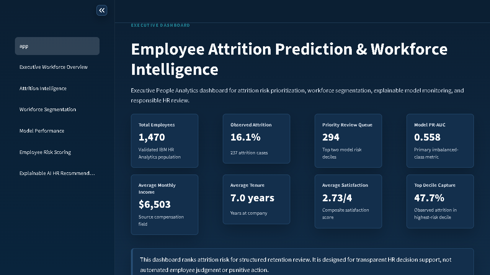
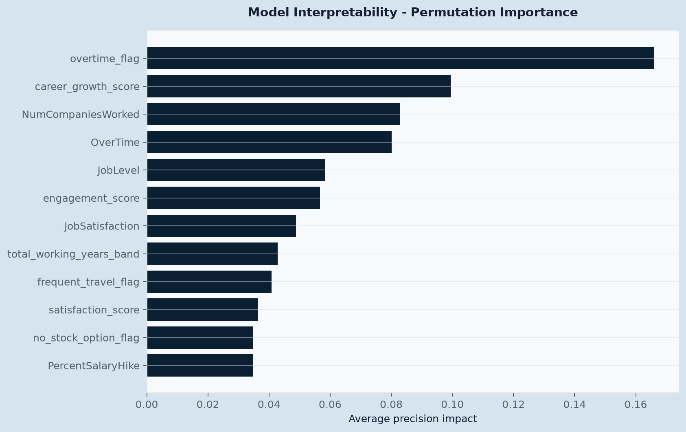

# Employee Attrition Prediction & Workforce Intelligence

[](https://github.com/felixsihite/employee-attrition-prediction-workforce-intelligence/actions/workflows/ci.yml)
[](https://employee-attrition-prediction-workforce-intelligence-uc5kedjxy.streamlit.app/)
[](pyproject.toml)
[](https://www.kaggle.com/datasets/pavansubhasht/ibm-hr-analytics-attrition-dataset)
[](LICENSE)

Professional People Analytics portfolio project for predicting employee attrition risk, explaining risk drivers, segmenting workforce patterns, and supporting responsible HR retention planning.

**Live Streamlit dashboard:** [employee-attrition-prediction-workforce-intelligence-uc5kedjxy.streamlit.app](https://employee-attrition-prediction-workforce-intelligence-uc5kedjxy.streamlit.app/)

**Recruiter project brief:** [docs/recruiter_project_brief.md](docs/recruiter_project_brief.md)

## Portfolio Snapshot

| Portfolio signal | Evidence |
| --- | --- |
| Business relevance | HR attrition risk prioritization, workforce segmentation, and responsible retention review |
| End-to-end delivery | Data validation, feature engineering, modeling, scoring, explainability, reports, and Streamlit dashboard |
| Reproducibility | `scripts/run_pipeline.py`, pinned dependency ranges, GitHub Actions validation, and committed outputs |
| Analytical depth | PR-AUC, recall, F2, balanced accuracy, threshold optimization, lift/gain, SQL reporting, and R statistical analysis |
| Responsible AI | Human review workflow, fairness summaries, model card, limitations, and non-automation positioning |



## Executive Summary

This project builds an end-to-end attrition prediction and workforce intelligence system using the IBM HR Analytics Employee Attrition & Performance dataset. The solution includes data quality validation, leakage-aware feature engineering, model comparison, threshold optimization, lift analysis, employee risk scoring, explainable model interpretation, SQL reporting, R statistical analysis scripts, and a polished Streamlit dashboard.

The project is designed as an HR decision-support case study. It does not claim guaranteed retention, causal proof, real-time HR monitoring, or actual ROI.

## Dataset Source

- Dataset: IBM HR Analytics Employee Attrition & Performance
- Kaggle source: https://www.kaggle.com/datasets/pavansubhasht/ibm-hr-analytics-attrition-dataset
- Raw file: `data/raw/WA_Fn-UseC_-HR-Employee-Attrition.csv`

## Dataset Overview

- Rows: 1,470
- Columns: 35
- Missing values: 0
- Duplicate rows: 0
- Target: `Attrition`
- Attrition distribution: No = 1,233, Yes = 237
- Attrition rate: 16.12%

## Business Problem

HR teams often react after resignation risk has already escalated. A structured workforce intelligence workflow helps prioritize retention review by identifying employees and segments with elevated attrition likelihood while preserving ethical human oversight.

## Business Solution

The project ranks employees by predicted attrition probability, explains key model drivers, groups employees into actionable risk bands, and gives HR teams a transparent intervention queue aligned with capacity limits.

## Project Architecture

```text
data/raw/                 Original Kaggle dataset, unchanged
data/processed/           Feature-engineered and modeling-ready datasets
notebooks/                Executive-grade analysis notebooks
src/                      Reusable data, feature, model, evaluation, scoring modules
sql/                      Workforce intelligence reporting queries
r/                        R statistical workforce analysis scripts
streamlit_app/            People Analytics dashboard
models/                   Serialized final model pipeline
outputs/                  Charts, reports, metrics, predictions, and risk scores
tests/                    Project quality tests
```

## Data Quality and Leakage Prevention

- Raw dataset is preserved unchanged.
- `EmployeeNumber` is used only as an identifier.
- `EmployeeCount`, `Over18`, and `StandardHours` are removed from modeling because they are constant.
- `Attrition` and `attrition_flag` are excluded from the feature matrix.
- Split strategy is stratified.
- Threshold tuning is performed on validation data, not the test set.
- Metrics prioritize PR-AUC, recall, F2, and lift instead of accuracy alone.

## Feature Engineering

HR-focused features include tenure bands, income bands, age bands, overtime and travel flags, early tenure indicators, no stock option flags, promotion gap ratios, satisfaction and engagement scores, career stagnation flags, compensation-to-job-level ratios, workload risk flags, and workforce risk segments.

## Model Comparison

| model | cv_roc_auc_mean | cv_pr_auc_mean | cv_recall_mean | validation_pr_auc | selection_score | selected_model |
| --- | --- | --- | --- | --- | --- | --- |
| Logistic Regression | 0.8210 | 0.6280 | 0.7000 | 0.6290 | 0.7040 | True |
| Random Forest | 0.8120 | 0.5730 | 0.4000 | 0.6010 | 0.5820 | False |
| Gradient Boosting | 0.8200 | 0.6240 | 0.3160 | 0.5820 | 0.5200 | False |
| Decision Tree | 0.6940 | 0.3750 | 0.5680 | 0.3580 | 0.5160 | False |

## Final Model

- Selected model: **Logistic Regression**
- Selected HR operating threshold: **0.50**
- ROC-AUC: **0.829**
- PR-AUC: **0.558**
- Precision: **0.398**
- Recall: **0.702**
- F2 score: **0.609**
- Balanced accuracy: **0.750**

## Lift and Decile Analysis

- Top 10% risk decile captures **36.2%** of observed attrition in the test set.
- Top 20% risk deciles capture **55.3%** of observed attrition in the test set.
- Risk deciles are used to align retention review with realistic HR capacity.

## Interpretability

The project uses permutation importance as a SHAP-equivalent interpretability fallback in environments where SHAP is unavailable. If SHAP is installed, the workflow can be extended without changing the core modeling contract.

Top model drivers in the current run:
- `overtime_flag`
- `career_growth_score`
- `NumCompaniesWorked`
- `OverTime`
- `JobLevel`
- `engagement_score`
- `JobSatisfaction`



## Dashboard Design

The Streamlit dashboard uses the approved main light background **#D6E4F0** with navy, blue, teal, amber, green, and red accents. Text colors are selected for readability in light and dark contexts.

Dashboard pages:
- Executive Workforce Overview
- Attrition Intelligence
- Workforce Segmentation
- Model Performance
- Employee Risk Scoring
- Explainable AI & HR Recommendations

Dashboard screenshots are exported for every page:
- `outputs/dashboard_screenshots/00_app.png`
- `outputs/dashboard_screenshots/00_app_executive_risk_signals.png`
- `outputs/dashboard_screenshots/01_executive_workforce_overview.png`
- `outputs/dashboard_screenshots/02_attrition_intelligence.png`
- `outputs/dashboard_screenshots/03_workforce_segmentation.png`
- `outputs/dashboard_screenshots/03_workforce_segmentation_matrix_detail.png`
- `outputs/dashboard_screenshots/04_model_performance.png`
- `outputs/dashboard_screenshots/05_employee_risk_scoring.png`
- `outputs/dashboard_screenshots/06_explainable_ai_hr_recommendations.png`

## Business Recommendations

- Prioritize retention review for employees in the highest risk deciles.
- Monitor overtime-heavy roles and groups with elevated attrition rates.
- Review career progression for employees with long promotion gaps.
- Build targeted engagement actions for low satisfaction segments.
- Use model explanations to make risk review transparent.
- Treat predictions as HR decision support, not automated decisions.

## Fairness and Ethics

The model should not be used for punitive decisions, employee surveillance, or automated employment outcomes. Group-level summaries are included for Gender, Department, and JobRole so reviewers can inspect risk concentration before any operational use.

## How to Run

```bash
python -m venv .venv
.venv\Scripts\activate
pip install -r requirements.txt
python scripts/run_pipeline.py
streamlit run streamlit_app/app.py
pytest
```

Python version target: **3.13.1**.
Runtime metadata is consolidated in `pyproject.toml`.

## R Statistical Workflow

The companion R scripts are optional statistical validation artifacts. Run them from the project root when R is available locally:

```bash
Rscript r/workforce_statistical_analysis.R
Rscript r/attrition_group_comparison.R
```

R outputs are written to `outputs/metrics/` and `outputs/reports/r_statistical_workforce_analysis.md`.

## Key Outputs

- `outputs/reports/data_quality_report.md`
- `outputs/reports/model_card.md`
- `outputs/reports/executive_insights.md`
- `outputs/reports/fairness_ethics_report.md`
- `outputs/risk_scores/employee_attrition_risk_scores.csv`
- `outputs/dashboard_screenshots/`
- `models/employee_attrition_model.joblib`

## Limitations

This is a structured historical HR analytics dataset, not a live HRIS platform. It has no real intervention outcomes, timestamps, verified cost records, or causal treatment effects. Any cost or ROI discussion must be presented as assumption-based simulation only.

## Portfolio Value

This repository demonstrates practical Data Scientist capability across business framing, data quality, feature engineering, supervised learning, imbalanced classification, model evaluation, explainability, SQL analytics, R statistical analysis, dashboard delivery, and responsible AI governance.
